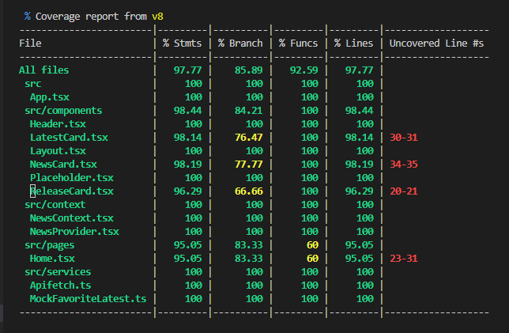

# Desafio React: transforme dados em notícias e acelere a sua carreira!

Olá, este é o teste de Frontend para pessoas desenvolvedoras junior da Trybe. O objetivo é analisar as habilidades das pessoas candidatas, com foco nos fundamentos principais de React e suas bibliotecas relacionadas.

Eu, Fabiano Liberatóri, aluno da <a href="https://www.betrybe.com/">Trybe</a>, apresento o que desenvolvi neste desafio. Para isso, repliquei a ideia de um sistema que captura as notícias mais recentes do IBGE e apresentar elas de forma organizada.

## O que utilizei para desenvolver.

- Iniciando o Projeto localmente com o vite com react-ts

- Criei a estrutura de pastas necessarias, como componentes, pages, services, imagens etc...

- Utilizei React-Routers, Context e Provider para fazer somente uma vez a chamada do ENDPOINT do IBGE, com isto deixando a pagina mais responsiva em toda a sua navegação.

- Para a estilização a da pagina, segui boa parte do figma deste desafio, apenas em alguns pontos deixei ao meu gosto, principalmente a parte responsiva para mobile, optei por utilizar module.css para maior precisão de tamanhos e margens.

## Desafios durante o desenvolvimento.

Como se tratou de um projeto totalmente vindo do zero e sem ajuda da dos mentores, para justamente ter um desafio real de um Desenvolvedor, tive problemas com conversões de arquivos JSON e alinhamentos de estilização.

Tive poucas vezes momentos em que estava com alguma dificuldade para desenvolver alguma logica para que a pagina funcionasse conforme o que ja tinha planejado.

Passei por volta de 30% do tempo para codar, pesquisando em documentações, videos e projetos que desenvolvi anteriormente.

## Cobertura de teste

Obtive mais de 85% na Branch de All files, e nas outras foram superiores a 92%.

Testes são de extrema importancia, com ele se diminui muito as changes de problemas de segurança e possiveis problemas performaticos ao app.

## Linguagens.

- HTML 5
- CSS 3
- Vite
- React
- JavaScript / TypeScript
